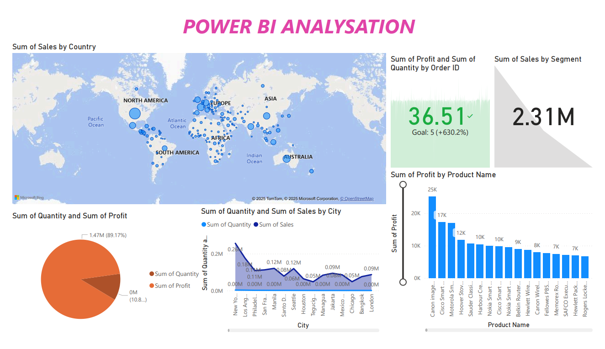

# GSalesPowerBI – Power BI Sales Analysis

Power BI dashboard analyzing **global sales, profit, quantity, products, customers, and business performance** across different countries, cities, and market segments.

## 📊 Dashboard Preview



## 🎯 Project Overview

This project uses **Microsoft Power BI** to analyze sales and profitability data and provide a clear view of business performance across different geographical locations and product categories.

The dashboard helps identify sales trends, profitable products, high-performing cities, and overall business performance.

## 📌 Key Metrics

- **Total Sales:** 2.31M
- **Total Profit:** 36.51K
- **Sales by Segment**
- **Quantity Sold:** 1.47M

## 📈 Dashboard Analysis

### 🌍 Sales by Country
Interactive map showing sales distribution across countries and regions.

### 💰 Profit & Quantity
Comparison of total profit and quantity sold to understand overall business performance.

### 🏙️ Sales & Quantity by City
Analysis of sales and quantity across major cities.

### 📦 Profit by Product
Identifies the products generating the highest profit.

### 👥 Sales by Segment
Comparison of sales across different customer segments.

## 🔍 Key Insights

- Sales are distributed across multiple countries and regions.
- A small group of products contributes significantly to overall profit.
- Different cities show significant variation in sales and quantity.
- Customer segments contribute differently to total sales.
- Geographic analysis helps identify strong and weak markets.

## 🛠️ Tools Used

- **Power BI**
- **Power Query**
- **DAX**
- **Microsoft Bing Maps**
- **Data Visualization**

## 📂 Project Structure

```text
GSalesPowerBI/
│
├── PowerBI/
│   ├── *.pbip
│   ├── *.Report/
│   └── *.SemanticModel/
│
├── ScreenShot/
│   └── DashBoard.png
│
├── .gitignore
└── README.md